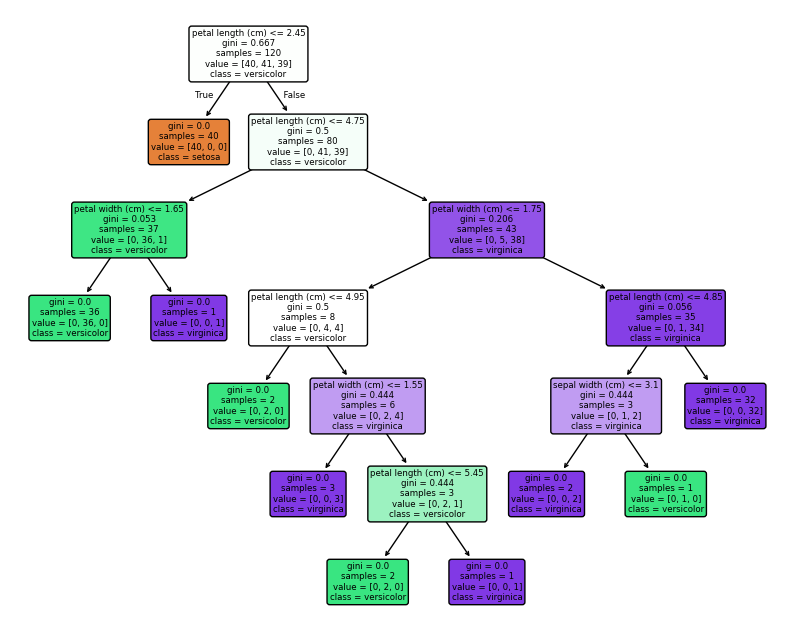
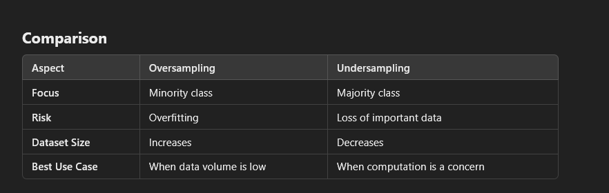

A decision tree is a popular model used in machine learning and decision analysis for classifying data and making predictions. It consists of nodes and edges, where:

    Root Node: This is the top-most node that represents the entire dataset. It is split based on the most significant feature to best segregate the data.

    Decision Nodes: These nodes represent the attributes or features used to make decisions. Each decision node divides the dataset into subsets based on the feature's values.

    Leaf Nodes: These are the terminal nodes that contain the final output or prediction, such as class labels or continuous values.

    Edges: They represent the decision rules and lead to either further decision nodes or leaf nodes.

How Decision Trees Work:

    The tree is built by repeatedly splitting the data into subsets based on the feature that best separates the data. The goal is to maximize the purity of each subset, meaning that the data points within each subset are as similar as possible.
    The most common algorithms for building decision trees include ID3, CART (Classification and Regression Trees), and C4.5.
    Decision trees can be used for both classification (predicting categories) and regression (predicting continuous values).

Advantages:

    Simple to understand and interpret.
    Can handle both numerical and categorical data.
    Can capture non-linear relationships.

Disadvantages:

    Prone to overfitting, especially with deep trees.
    Sensitive to small variations in data.
    https://scikit-learn.org/1.5/modules/tree.html
    
    import matplotlib.pyplot as plt
from sklearn.datasets import load_iris
from sklearn.tree import DecisionTreeClassifier, plot_tree
from sklearn.model_selection import train_test_split

# Load Iris dataset
iris = load_iris()
X = iris.data
y = iris.target

# Split the dataset into training and test sets
X_train, X_test, y_train, y_test = train_test_split(X, y, test_size=0.2, random_state=42)

# Initialize and train a Decision Tree classifier
clf = DecisionTreeClassifier(random_state=42)
clf.fit(X_train, y_train)

# Plot the decision tree
plt.figure(figsize=(10,8))
plot_tree(clf, filled=True, feature_names=iris.feature_names, class_names=iris.target_names, rounded=True)
plt.show()

Oversampling and undersampling are two common techniques used in data preprocessing to handle class imbalance in machine learning datasets. Here's an overview:
Oversampling

Definition: Increasing the number of samples in the minority class to balance the dataset.
Techniques

    Random Oversampling:
        Duplicates existing minority class samples randomly.
        Risk: Overfitting due to repetitive data.

    SMOTE (Synthetic Minority Oversampling Technique):
        Generates synthetic samples for the minority class by interpolating between existing samples.
        Reduces overfitting compared to random oversampling.

    ADASYN (Adaptive Synthetic Sampling):
        Focuses on generating synthetic samples for the minority class in regions where it is sparsely populated.

Undersampling

Definition: Reducing the number of samples in the majority class to balance the dataset.
Techniques

    Random Undersampling:
        Randomly removes samples from the majority class.
        Risk: Loss of potentially important data.

    Tomek Links:
        Identifies and removes ambiguous samples from the majority class that are closest to the minority class.
        Helps in creating a cleaner decision boundary.

    Cluster Centroids:
        Replaces clusters of majority class samples with their centroids to reduce data points while preserving class structure.

Choosing Between the Two

    Small Datasets: Use oversampling (e.g., SMOTE) to avoid data loss.
    Large Datasets: Use undersampling to reduce computational cost.
    Hybrid Approaches: Combine both techniques (e.g., oversample minority class and undersample majority class).